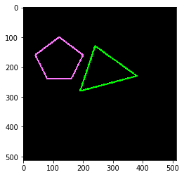
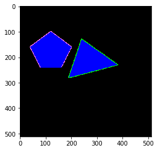

# Get-Index-by-Inside-of-Polygon-of-a-Picture
At times we run into the problem of identifying which pixels in an image are within a certain polygon whether it is convex or non-convex. For this I developed a function to identify which indexes are within the polygon, this is important in the need to build new variables for a learning problem, which was my case. My algorithm was based on the Ray Casting method.

# Example

Below folow one example of image with polygons.

And then the image with all the pixels inside the polygons with the color blue.

